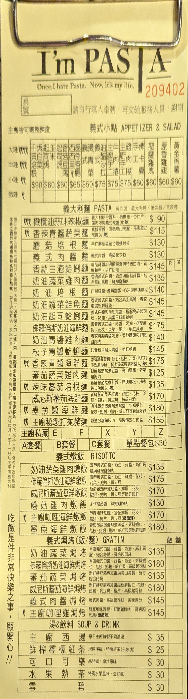

住在台北的大家都知道，台北最熱鬧的電子百貨商場就在忠孝新生站。
菜雞如我居然沒有備用充電器跟線材，只好去光華商場一趟了。

剛下班也沒吃飯，就在附近逛逛找吃的，就看到這家連鎖店 I'm Pasta。
既然吃了，就該發表自己的感想，接下來我會來分享我今天點的餐以及他們的優缺點。
<!-- more -->
# 餐點

我這次點了一份麵食配套餐，套餐總共有四種 超值 A, 賺到 B, 無敵 C, 經濟 D，分別有類似的內容，但價格不一樣，所以我選擇的內容最全的 **無敵 C** 。
接下來的分享就是 **無敵 C** 究竟有什麼呢？是否值得花這個錢呢？

## 套餐內容

我的套餐有
- 肉醬義大利麵
- 沙拉佐芒果醬
- 兩個爆漿小餐包
- 玉米濃湯
- 清爽檸檬紅茶

推薦食用順序: 玉米濃湯 -> 清爽檸檬紅茶 -> 爆漿小餐包 -> 清爽檸檬紅茶 -> 沙拉佐芒果醬 -> 清爽檸檬紅茶 -> 肉醬義大利麵 -> 清爽檸檬紅茶

### 肉醬義大利麵

我非常喜歡義大利麵，有別與平常吃的義大利麵，我點了貝殼麵，每顆小貝殼都可以裝滿醬汁，吃起來非常有嚼勁，醬汁調味恰到好處。肉醬其實帶點微辣的口感，雖然我不喜歡吃辣，但這個口感卻帶出這家店的特色。

### 沙拉佐芒果醬

如名所示，他們的沙拉使用了甜甜蜜蜜的芒果醬，搭配上新鮮的蔬菜，吃起來非常清爽，完全不會有不新鮮的草味，我很喜歡。

### 爆漿小餐包

說實話，他們的餐包在送上來的時候是溫的，內餡跟體溫差不多，我覺得這樣不太好吃，但我還是吃完了，因為我很餓。

### 玉米濃湯

他的玉米濃湯相對特別，湯濃味不重，但是有玉米的香甜味，我覺得很不錯。

### 清爽檸檬紅茶

他的紅茶是我喝過很不錯的，不會太甜，也不會太淡，檸檬的酸味也剛好，我覺得非常清爽解渴，還可以將每個餐點的味道洗掉，讓我可以好好品嚐每個餐點。

# 總結

我覺得這家店的餐點非常不錯，價格中等，我覺得值得推薦給大家，如果你也在光華商場附近，可以去試試看。

# 資訊

## 菜單

地址: 100台北市中正區八德路一段82巷9弄7號